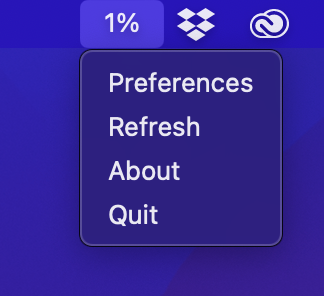

# FlashforgeStatusbar
Mac Status Bar app and CLI tool to show current progress from Flashforge 3D printers.

## Install
Download the latest version from [https://github.com/christiandt/FlashforgeStatusbar/releases](https://github.com/christiandt/FlashforgeStatusbar/releases). 

Unzip and move `FlashforgeStatusbar.app` to the Applications folder of your computer.

## Gotchas
Code is hacked together on vacation, expect stuff to break.

## UI Windows

## CLI version / Development Environment:
To download necessary requirements, run the make command:

    make

To run the meter, simply run the make run command:

    make run

You can provide an integer as argument to specify the update interval. Data will be fetched from the API of the router, so only local connections will be made, and thus not incur traffic on your mobile connection.

	make run update=10

This will set an update interval of 10 seconds. The default IP for the 3D printer is set to 10.0.0.111, and the default port is set to 8899. You can override these values using the environment variable `FLASHFORGE_IP` and `FLASHFORGE_PORT` respectively. 

## Example Output:

[██████████████████████████████████████████----------------------------------------------------------] 42%
